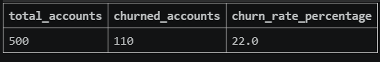
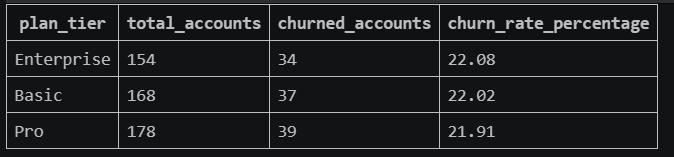
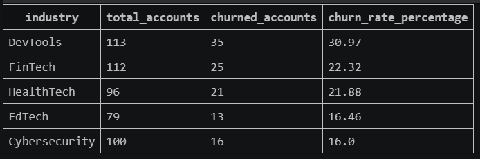
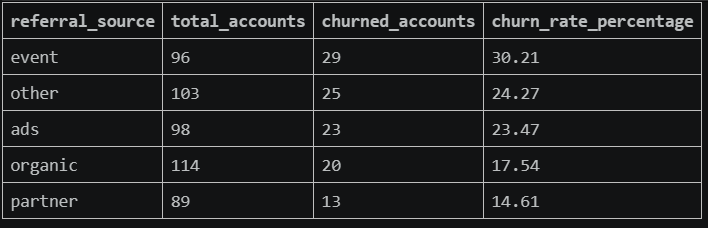
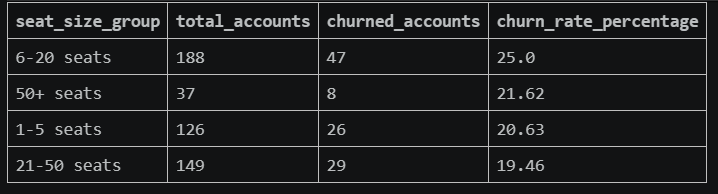
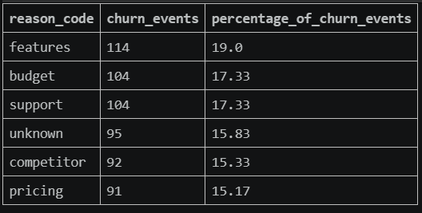
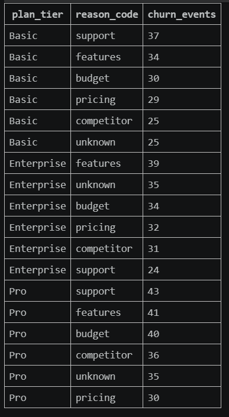

# SaaS Customer Churn & Revenue-at-Risk Analysis

## Project Status

**Status:** Work in Progress
**Current Stage Completed:** SQL data loading, data quality checks and churn analysis
**Next Stages:** Revenue-at-risk SQL analysis, Python analysis and Power BI dashboard development

## Project Overview

This project analyses customer churn patterns for **RavenStack**, a synthetic SaaS business dataset. The goal is to identify high-risk customer segments, understand churn drivers and develop business recommendations to improve customer retention.

The project currently uses **SQL, SQLite, Python for data loading, VS Code and Git/GitHub**. Power BI dashboard development will be added in the next stage.

## Business Problem

RavenStack wants to understand why customers are leaving before its public launch. The key business questions are:

* What is the overall customer churn rate?
* Which plan tiers have the highest churn?
* Which industries are most at risk?
* Which referral sources bring higher-churn customers?
* Which customer seat-size groups churn the most?
* What are the most common churn reasons?
* How do churn reasons differ across plan tiers?

## Tools Used

* **VS Code** – project development environment
* **Git & GitHub** – version control and portfolio presentation
* **SQLite** – local relational database
* **SQL** – data quality checks and churn analysis
* **Python** – CSV loading into SQLite
* **Power BI** – dashboard development planned for the next stage

## Dataset

Dataset: RavenStack Synthetic SaaS Dataset
Author: River @ Rivalytics
Format: CSV, multi-table relational dataset
License: Educational and portfolio use permitted with credit to the original author.

The dataset contains:

| Table           |   Rows | Description                                   |
| --------------- | -----: | --------------------------------------------- |
| accounts        |    500 | Customer account-level information            |
| subscriptions   |  5,000 | Subscription, MRR, ARR and billing details    |
| feature_usage   | 25,000 | Product usage and feature activity            |
| support_tickets |  2,000 | Customer support interactions                 |
| churn_events    |    600 | Churn reasons, churn dates and churn feedback |

## Database Structure

The dataset follows a relational structure:

```text
accounts.account_id
│
├── subscriptions.account_id
│   └── feature_usage.subscription_id
│
├── support_tickets.account_id
└── churn_events.account_id
```

## Project Workflow

### 1. Project Setup

The project was structured in VS Code with separate folders for raw data, SQL scripts, Python scripts, reports, screenshots and future Power BI work.

### 2. Data Loading

A Python script was used to load the CSV files into a local SQLite database.

File used:

```text
python/load_data_to_sqlite.py
```

### 3. Data Quality Checks

SQL checks were performed to validate:

* Row counts across all five tables
* Duplicate primary key checks
* Missing values in key account and subscription fields
* Broken relationships between linked tables

File used:

```text
sql/02_data_quality_checks.sql
```

### 4. Churn Analysis

SQL queries were used to analyse:

* Overall customer churn rate
* Churn rate by plan tier
* Churn rate by industry
* Churn rate by referral source
* Churn rate by seat-size group
* Top churn reasons
* Churn reasons by plan tier

File used:

```text
sql/03_churn_analysis.sql
```

## Data Quality Findings

* All five CSV files were successfully loaded into SQLite.
* Row counts matched the dataset documentation.
* No missing values were found in key account or subscription fields.
* No broken relationships were found between accounts, subscriptions, feature usage, support tickets and churn events.
* Duplicate `usage_id` values were identified in the `feature_usage` table. Since all feature usage records link correctly to valid subscription IDs, the analysis uses `subscription_id` for joins rather than relying on `usage_id` as a unique identifier.

## SQL Analysis Results

### 1. Overall Customer Churn Rate



The overall churn rate is **22.0%**, with **110 churned accounts** out of **500 total accounts**.

This means that around one in every five customers has churned, making retention a clear business concern for RavenStack.

### 2. Churn Rate by Plan Tier



| Plan Tier  | Total Accounts | Churned Accounts | Churn Rate |
| ---------- | -------------: | ---------------: | ---------: |
| Enterprise |            154 |               34 |     22.08% |
| Basic      |            168 |               37 |     22.02% |
| Pro        |            178 |               39 |     21.91% |

Churn is almost evenly distributed across all three plan tiers. Enterprise has the highest churn rate at **22.08%**, but the difference between Enterprise, Basic and Pro is very small.

This suggests that churn is not limited to one pricing tier. Product experience, support quality and perceived value may be affecting customers across all plans.

### 3. Churn Rate by Industry



| Industry      | Total Accounts | Churned Accounts | Churn Rate |
| ------------- | -------------: | ---------------: | ---------: |
| DevTools      |            113 |               35 |     30.97% |
| FinTech       |            112 |               25 |     22.32% |
| HealthTech    |             96 |               21 |     21.88% |
| EdTech        |             79 |               13 |     16.46% |
| Cybersecurity |            100 |               16 |     16.00% |

The **DevTools** segment has the highest churn rate at **30.97%**, which is significantly higher than the overall churn rate of **22.0%**.

This suggests that DevTools customers may have stronger feature expectations, more technical requirements or lower tolerance for product limitations.

### 4. Churn Rate by Referral Source



| Referral Source | Total Accounts | Churned Accounts | Churn Rate |
| --------------- | -------------: | ---------------: | ---------: |
| Event           |             96 |               29 |     30.21% |
| Other           |            103 |               25 |     24.27% |
| Ads             |             98 |               23 |     23.47% |
| Organic         |            114 |               20 |     17.54% |
| Partner         |             89 |               13 |     14.61% |

Customers acquired through **events** have the highest churn rate at **30.21%**, while partner referrals have the lowest churn rate at **14.61%**.

This suggests that partner-led acquisition may bring better-fit customers, while event-led acquisition may need stronger qualification, onboarding or expectation-setting.

### 5. Churn Rate by Seat Size Group



| Seat Size Group | Total Accounts | Churned Accounts | Churn Rate |
| --------------- | -------------: | ---------------: | ---------: |
| 6–20 seats      |            188 |               47 |     25.00% |
| 50+ seats       |             37 |                8 |     21.62% |
| 1–5 seats       |            126 |               26 |     20.63% |
| 21–50 seats     |            149 |               29 |     19.46% |

The **6–20 seats** segment has the highest churn rate at **25.0%**.

This may indicate that small-to-mid-sized teams are large enough to require value from collaboration features, but may still be sensitive to onboarding, budget and support issues.

### 6. Top Churn Reasons



| Reason Code | Churn Events | Percentage of Churn Events |
| ----------- | -----------: | -------------------------: |
| Features    |          114 |                     19.00% |
| Budget      |          104 |                     17.33% |
| Support     |          104 |                     17.33% |
| Unknown     |           95 |                     15.83% |
| Competitor  |           92 |                     15.33% |
| Pricing     |           91 |                     15.17% |

The most common churn reason is **features**, accounting for **19.0%** of churn events.

Budget and support are also major churn drivers, each representing **17.33%** of churn events. This suggests that churn is driven by a mix of product value, affordability and customer experience.

### 7. Churn Reasons by Plan Tier



Key patterns by plan tier:

* **Basic:** Support is the top churn reason.
* **Enterprise:** Features are the top churn reason.
* **Pro:** Support and features are the top churn reasons.

This suggests that each plan tier requires a different retention strategy. Basic users may need faster support and clearer onboarding, while Enterprise customers may need stronger feature depth, product reliability and roadmap alignment.

## Key Insights

1. The overall churn rate is **22.0%**, meaning customer retention is a clear business risk.
2. Churn is almost equal across Basic, Pro and Enterprise plans, suggesting the issue is not limited to one pricing tier.
3. **DevTools customers** show the highest churn rate at **30.97%**, making them the most at-risk industry segment.
4. **Event-acquired customers** have the highest churn rate at **30.21%**, while partner-acquired customers have the lowest churn rate at **14.61%**.
5. Customers with **6–20 seats** have the highest churn rate at **25.0%**.
6. The top churn reason is **features**, followed by **budget** and **support**.
7. Retention strategy should be segmented by plan tier, acquisition source and industry.

## Business Recommendations

### 1. Improve feature fit for DevTools customers

DevTools customers have the highest churn rate. RavenStack should analyse feature usage patterns for this segment, identify product gaps and prioritise improvements for technical users.

### 2. Strengthen onboarding for event-acquired customers

Event-acquired customers churn at the highest rate. RavenStack should improve qualification, onboarding and expectation-setting for customers acquired through events.

### 3. Build a targeted retention plan for 6–20 seat customers

The 6–20 seat segment has the highest churn rate by seat size. This group may need better onboarding, clearer team adoption support and stronger value communication.

### 4. Address feature-related churn

Since features are the most common churn reason, product managers should review missing feature feedback, usage patterns and competitor positioning.

### 5. Improve support experience for Basic and Pro users

Support is a major churn driver, especially for Basic and Pro customers. RavenStack should monitor ticket resolution time, escalation rate and satisfaction scores for these segments.

## Repository Structure

```text
SaaS Customer Churn Revenue Risk Analysis
│
├── data_raw
│   ├── README.md
│   ├── ravenstack_accounts.csv
│   ├── ravenstack_subscriptions.csv
│   ├── ravenstack_feature_usage.csv
│   ├── ravenstack_support_tickets.csv
│   └── ravenstack_churn_events.csv
│
├── data_cleaned
│
├── database
│   └── ravenstack.db
│
├── sql
│   ├── 01_create_tables.sql
│   ├── 02_data_quality_checks.sql
│   ├── 03_churn_analysis.sql
│   └── 04_revenue_risk_analysis.sql
│
├── python
│   └── load_data_to_sqlite.py
│
├── powerbi
│
├── reports
│   ├── insights_summary.md
│   └── screenshots
│       ├── 01_overall_churn_rate.png
│       ├── 02_churn_by_plan_tier.png
│       ├── 03_churn_by_industry.png
│       ├── 04_churn_by_referral_source.png
│       ├── 05_churn_by_seat_size_group.png
│       ├── 06_top_churn_reasons.png
│       └── 07_churn_reasons_by_plan_tier.png
│
└── README.md
```

## Next Steps

The next stage of this project will include:

* Revenue-at-risk analysis using MRR and ARR
* Python analysis for churn, usage and support patterns
* Power BI dashboard development
* Final executive summary
* CV-ready project bullets

## Current CV-Ready Project Description

**SaaS Customer Churn & Revenue-at-Risk Analysis | SQL, Python, Power BI**

* Built a structured SaaS churn analysis workflow using SQL, SQLite, Python and GitHub to identify high-risk customer segments and churn drivers.
* Loaded and analysed **500 accounts**, **5,000 subscriptions**, **25,000 feature usage records**, **2,000 support tickets** and **600 churn events**.
* Identified a **22.0% overall churn rate**, with highest churn among **DevTools customers**, **event-acquired customers** and **6–20 seat accounts**.
* Translated SQL findings into business recommendations focused on onboarding, feature fit, support improvement and customer retention strategy.

## Dataset Credit

This project uses the RavenStack synthetic SaaS dataset created by **River @ Rivalytics**. The dataset is fully synthetic and used for educational and portfolio purposes.
